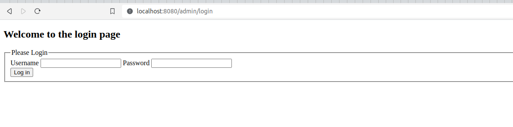
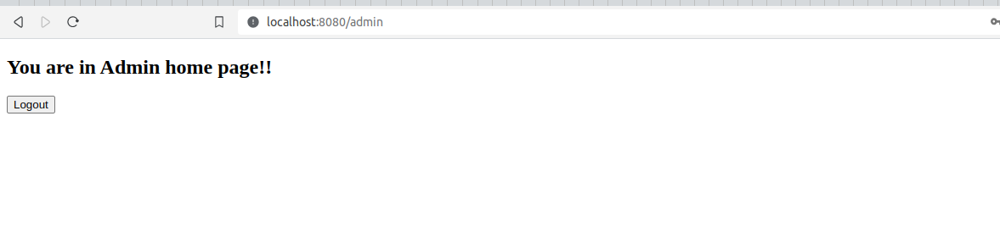
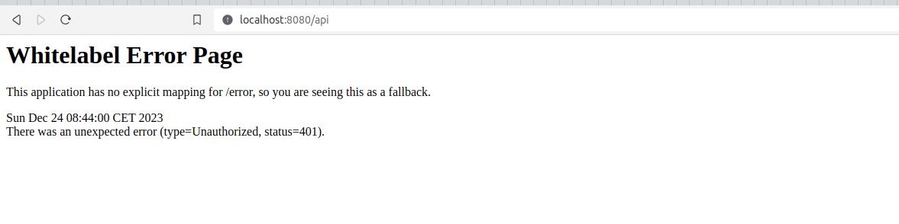
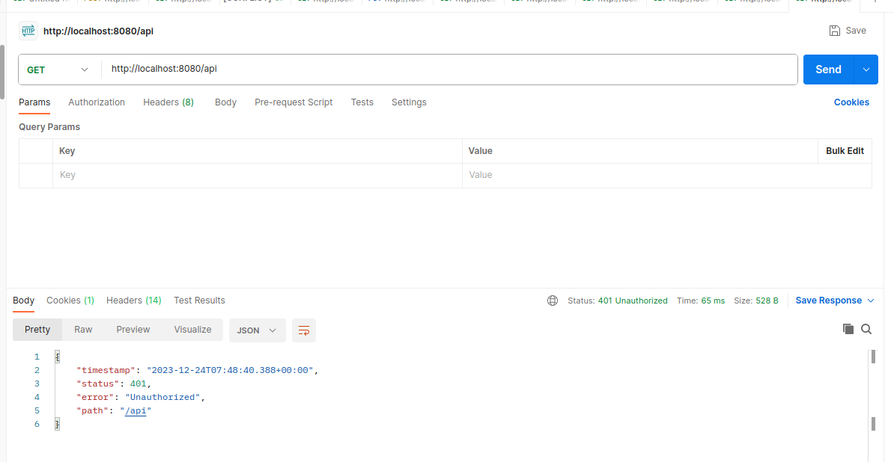
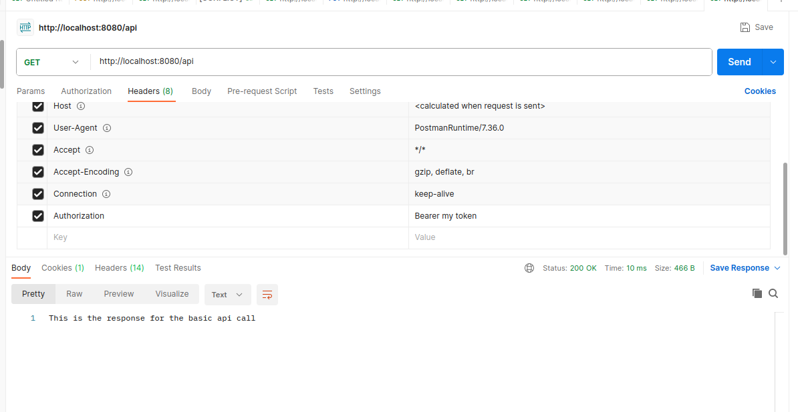
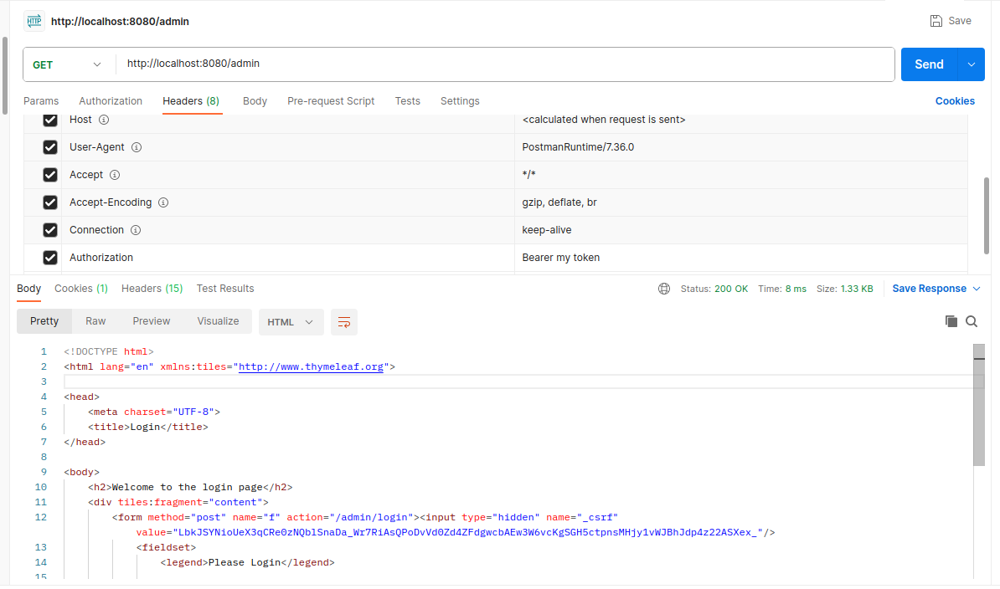

# Spring security multiple authentication strategies

This project shows you how to setup a multiple authentication strategies in spring boot application. We created two
authentication strategies:

* Form authentication strategie: It handles any request that starts with **/admin**.
* Jwt authentication strategie: It handles any request that starts with **/api**.

# Run the project

execute ``` mvn spring-boot:run```

# Test admin authentication

Start the project, then open your browser in **http://localhost:8080/admin**, you will be redirected to **http://localhost:8080/admin/login**



Write anything as _**username**_ and _**password**_, you will be redirected to **http://localhost:8080/admin**



Click on the **logout button**, you will be redirected to the admin login page. If you try to access to the admin home
page again, you will be redirected to the admin login page.

When you log in from admin login page. Try to access this url **http://localhost:8080/api** will result an
unauthorized (401) error page



# Test api authentication

Open your api client like [Postman](https://www.postman.com/downloads/) execute a request with the url **http://localhost:8080/api**, you will get an unauthorized (401) response



Add the header **Authorization** and value **Bearer [any_token]**, then run the request again. You will get a success (200) response



Change the request url from **http://localhost:8080/api** to **http://localhost:8080/admin** and execute. Will get the
admin login page as the response

